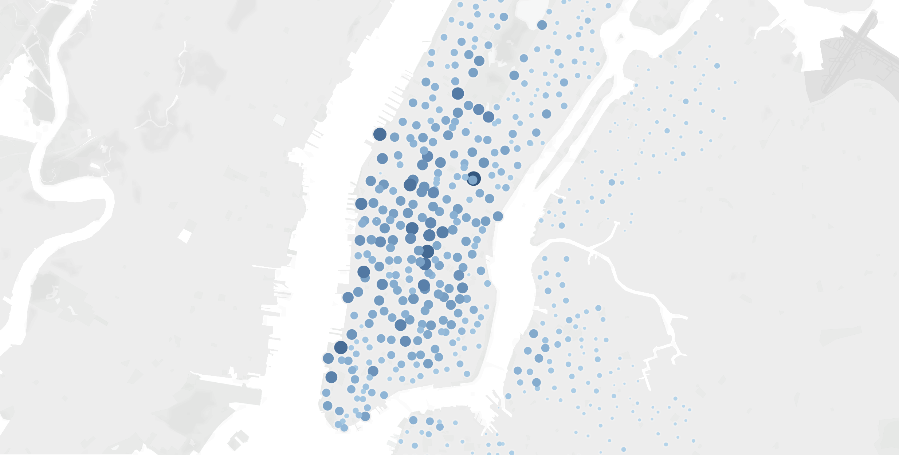
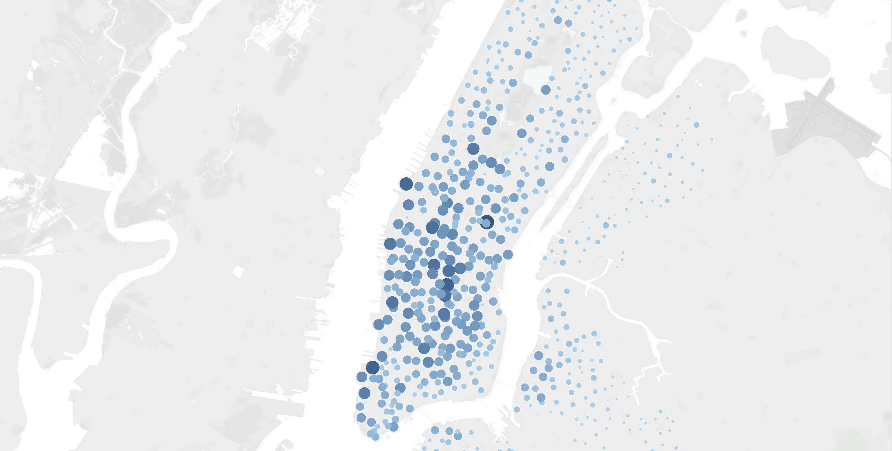
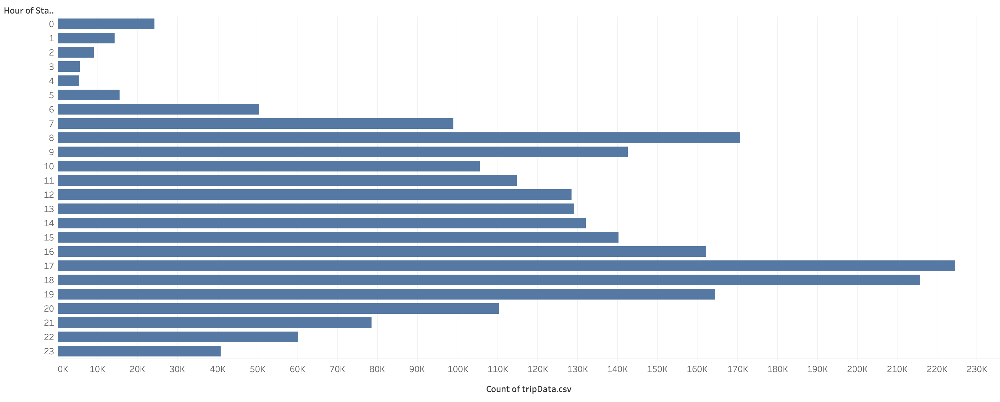
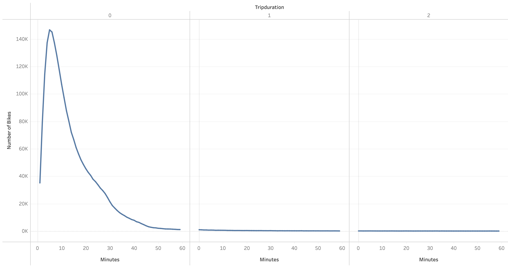
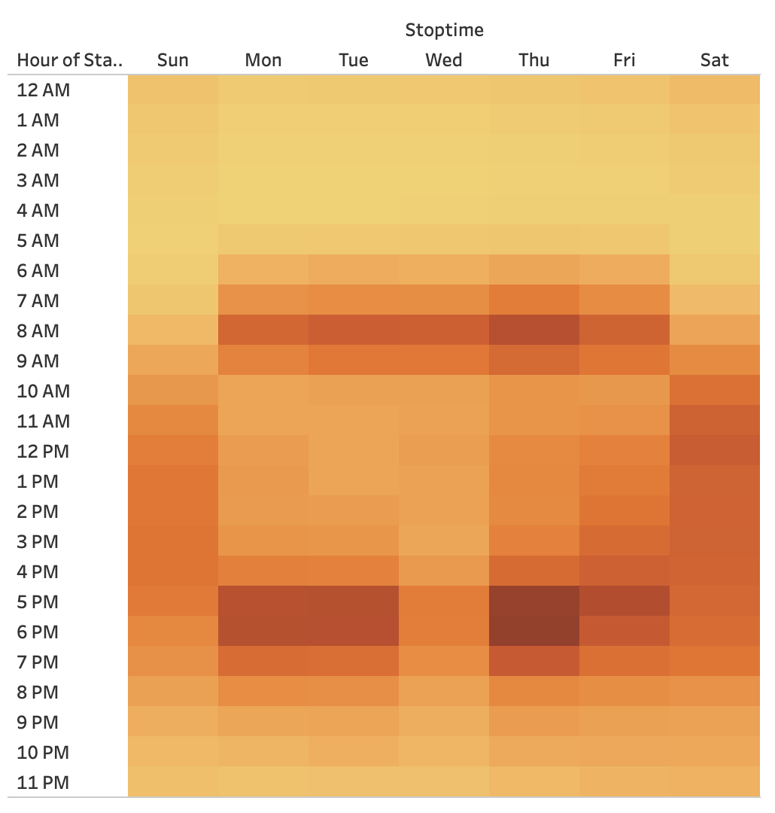
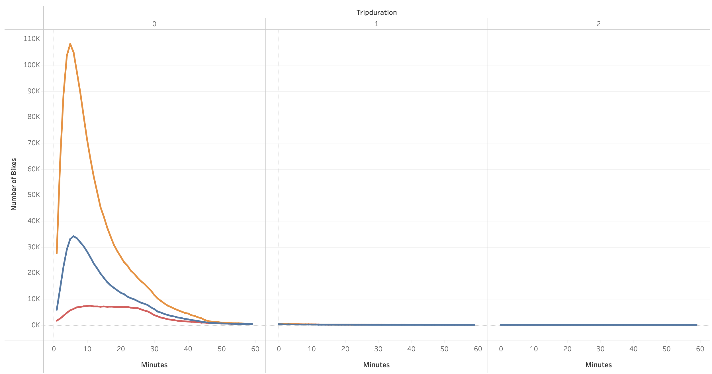
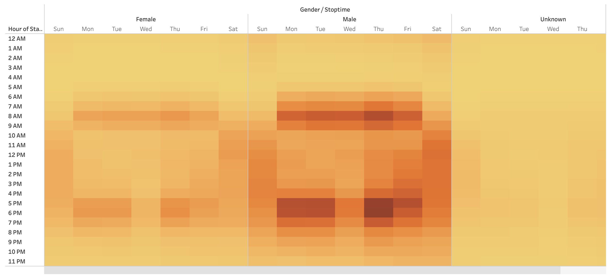
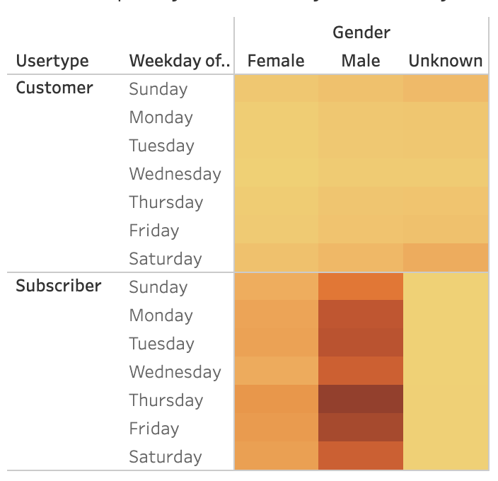

# Bikesharing
Bikeshare Analysis Project for UT Austin Data Analysis & Visualization Program  

## Project Overview
We were asked to analyze bikeshare data and create a series of visualizations that would describe ridership patterns. We analyzed ride data by starting and ending location, and looked as well at usage times based on gender and on customer/subscriber type. We created visualizations and a final story report in Tableau.  
<a href="https://public.tableau.com/app/profile/travis.harry/viz/Bikeshare_Report/BikeshareReport">Final Report - Tableau Story</a>

## Resources
- Data Sources: citibikenyc.com (2019-08-citibike-tripdata.csv)
- Software: Python, Tableau, Jupyter Notebook

## Results
#### - Top Starting and Ending Locations

We used the latitude/longitude coordinates for each ride's starting and ending locations to create a map of New York City, then adjusted the marker sizes and colors to reflect the frequency of rides to and from each location. The analysis shows that rides often originate outside the city and move inward to the city center.
 
<a href="https://public.tableau.com/app/profile/travis.harry/viz/Bikeshare_StartLocs/TopStartingLocations">Top Starting Locations</a>

 

 
<a href="https://public.tableau.com/app/profile/travis.harry/viz/Bikeshare_EndLocs/TopEndingLocations">Top Ending Locations</a>

 

 

#### - Peak Hours

We created a bar chart to show the count of rides by each hour of the day. This chart shows that the peak hours of the day are 8-9am and 5-6pm.
 
<a href="https://public.tableau.com/app/profile/travis.harry/viz/Bikeshare_PeakHours/AugustPeakHours">Peak Hours</a>

 

 

#### - Checkout Times

We charted the number of trips by trip duration. This shows that most trips last less than an hour, with the greatest number being around ten minutes.
 
<a href="https://public.tableau.com/app/profile/travis.harry/viz/Bikeshare_CheckoutTimes/CheckoutTimesforUsers">Checkout Times</a>

 

 

#### - Trips by Weekday

We created a heatmap to show the most popular times of week to ride. The most popular times corresponded to the business day morning/evening rush hours. Weekend days were more spread out.
 
<a href="https://public.tableau.com/app/profile/travis.harry/viz/Bikeshare_TripsWeekdayHour/TripsbyWeekdayperHour">Trips by Weekday</a>

 

 

#### - Breakdown by Gender

We created a pie chart showing ride usage by gender. The bulk of customers are male, with females or those of unknown gender composing a smaller segment of the customer base.
 
<a href="https://public.tableau.com/app/profile/travis.harry/viz/Bikeshare_GenderBreakdown/GenderBreakdown">Breakdown by Gender</a>

 

 

#### - Checkout Times by Gender

We charted trip duration based on gender. The genders shared similar riding habits, preferring to ride less than an hour.
 
<a href="https://public.tableau.com/app/profile/travis.harry/viz/Bikeshare_CheckoutTimesGender/CheckoutTimesbyGender">Checkout Times by Gender</a>

 

 

#### - Trips by Weekday by Gender

We created another heatmap to show the differences in usage by hour based on gender. This shows that female riders and male riders share similar usage patterns throughout the week.
 
<a href="https://public.tableau.com/app/profile/travis.harry/viz/Bikeshare_TripsWeekdayHourGender/TripsbyWeekdayperHourbyGender">Trips by Weekday by Gender</a>

 

 

#### - Trips by Weekday by Gender and Usertype

We created a final heatmap showing usage frequency by time, as well as by gender and whether the user was a subscriber or a one-time customer. This heatmap shows that one-time customers tend to ride more on weekends, while subscribers tend to ride during the week, especially during rush hour times.
 
<a href="https://public.tableau.com/app/profile/travis.harry/viz/Bikeshare_UserTripsGenderWeekday/UserTripsbyGenderbyWeekday">Trips by Weekday by Gender and Usertype</a>

 

 

## Summary

The analysis of the bikeshare data has shown that most users are male. Even so, gender does not play as much of a role in rider habits. Subscribers tend to ride during the weekday, gravitating towards rush hour times. These users are likely workers in the city using bikes to commute to and from their jobs. Non-subscribers tend to ride on the weekends. These users are likely tourists in town for the weekend using bikes to visit sightseeing locations. For further analysis we should ask if these non-subscribers are indeed one-time users or if they are repeat users. We should also ask if the numbers of subscribers who are riding on weekends is greater or less than the number of non-subscribers.
